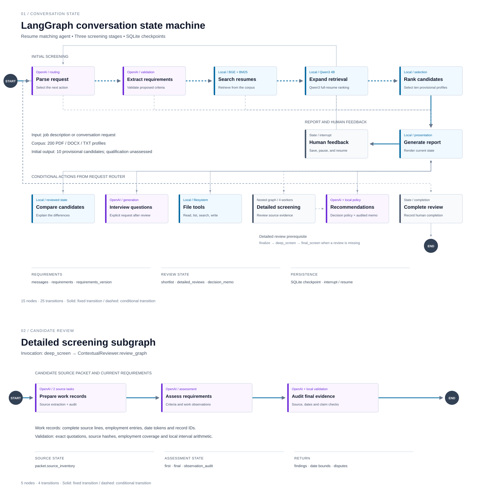

# Resume Matching Agent

I built this project to connect the filesystem assistant and resume RAG matcher through a persistent LangGraph conversation. The agent accepts a job description, keeps track of changing requirements, selects ten resumes for review, checks their source evidence and produces a recommendation. The browser interface keeps the conversation beside the candidate records.

Screening has three rounds. Initial screening ranks all 200 resumes locally. Detailed screening uses OpenAI to assess the ten selected candidates against the same written criteria. Recommendation compares those reviewed findings. Source quotations, date calculations, uncertainty and requirement revisions remain available for inspection.

## Demo

[Watch the demo](docs/media/resume-matching-agent-demo.mp4) · 9 min 57 sec · MP4, 23 MB

The recording follows a search for backend developers through initial screening, detailed review and recommendations. It includes requirement changes, candidate comparisons and ranking explanations, source evidence, interview preparation and reading a resume from disk. Activity and the interactive LangGraph diagrams explain the workflow. It also shows the report preview and how to restore a saved review.

Text overlays explain which steps run locally and which use OpenAI. Processing waits are accelerated with visible fast-forward indicators. The report is previewed, with its Markdown and JSON download options shown.

## Architecture



The [interactive diagram](docs/architecture.html) opens locally in a browser. Select a node to inspect its state fields and outgoing transitions. Both diagrams are generated from the compiled graphs; the [architecture notes](docs/architecture.md) explain the state and routing.

| Round | Processing | Result |
| --- | --- | --- |
| Initial screening | OpenAI interprets the request and compiles shared evidence standards. A local Qwen3 reranker scores every complete resume. BGE and BM25 retrieve source passages. | Ten provisional candidates, relevance points and unverified source leads. |
| Detailed screening | OpenAI extracts and audits work records, assesses every criterion and checks the proposed evidence. Python calculates dates and verifies source references. | Requirement findings, strengths, gaps, work context, duration bounds and unresolved disagreements. |
| Recommendation | Python applies the decision policy. OpenAI writes a comparative memo and audits its claims against the reviewed facts. | Advance, hold or no-hire advice, priority groups, comparisons and evidence that could change a decision. |

Comparisons use available findings without starting another assessment. Interview questions are generated only on request, after detailed screening. A changed requirement starts a new revision and clears findings that no longer apply.

## Dataset and attribution

The application includes 200 profiles from the external synthetic [People dataset](https://huggingface.co/datasets/akzaidan/People): 100 PDF, 60 DOCX and 40 TXT documents. I rendered these formats from sanitized source records. Names are replaced with candidate labels; sampled demographic fields and administrative selection labels stay out of screening text.

I retained 50 separate People profiles with development ranking judgments, 50 additional profiles with source-based criterion judgments, and the original 100 generated regression resumes. The additional 50 have one assigned request each, so their labels cannot measure whole-corpus ranking. These collections have been inspected during development and have no independent human annotation.

The [dataset notes](docs/dataset.md) describe selection, identities, dates and reproduction. [Attribution](data/ATTRIBUTION.md) records source revisions and licensing. Employment calculations use a fixed `2026-09-01` snapshot.

## Installation

Use Python 3.12 or 3.13 and [uv](https://docs.astral.sh/uv/getting-started/installation/):

```bash
git clone https://github.com/aadetya/resume-matching-agent.git
cd resume-matching-agent
uv sync --frozen
cp .env.example .env
```

Open the new `.env` file in the repository root and replace the empty key with your own OpenAI API key:

```dotenv
OPENAI_API_KEY=replace-with-your-own-api-key
OPENAI_MODEL=gpt-5.6-luna
```

The repository contains no shared key. Your API account needs available quota and access to the selected model. `OPENAI_MODEL` can select another compatible model; its responses and runtime may differ from the recorded results. The application uses the Responses API with structured output. Keep `.env` local; Git ignores it.

Build the local index, then load the environment file when starting the app:

```bash
uv run python scripts/build_index.py --window 100 --overlap 25
uv run --env-file .env python app.py
```

Open `http://127.0.0.1:7860`. The application does not load `.env` by itself. After changing a key or model, stop and restart it with the command above. `OPENAI_MODEL` takes precedence over `MATCHING_MODEL`, followed by the default `gpt-5.6-luna`.

For pip installation instead of uv:

```bash
python3.12 -m venv .venv
source .venv/bin/activate
python -m pip install -r requirements.txt
python -m pip install -e . --no-deps
export OPENAI_API_KEY="<your key>"
export OPENAI_MODEL="gpt-5.6-luna"
python scripts/build_index.py --window 100 --overlap 25
python app.py
```

`uv.lock` fixes the complete environment. `requirements.txt` provides pinned packages for the alternative pip setup.

### Local models and hardware

The first index build downloads the pinned `BAAI/bge-small-en-v1.5` embedding model. Statistical entity extraction uses `en_core_web_sm`. Initial screening downloads approximately 8 GB of `Qwen/Qwen3-Reranker-4B` weights at revision `22e683669bc0f0bd69640a1354a6d0aebcfeede5`; later runs reuse the model cache.

The ranker selects CUDA, Apple Metal, then CPU according to availability. The measured machine was an Apple M2 Max with 32 GB RAM. Allow space for the downloads and additional memory for model execution. CPU runs in full precision and can be substantially slower; a full 200-profile CPU timing has not been measured. The [evaluation notes](docs/ranking_validation.md) separate model loading, local ranking and connected processing times.

### Running without an OpenAI key

The local components work without a key. The complete conversational workflow requires one.

| Capability | Without a key |
| --- | --- |
| Extract PDF/DOCX/TXT, inspect files and audit the dataset | Available |
| Build the local index and run frozen-criteria ranking benchmarks | Available |
| Open the diagrams and run offline tests | Available |
| Open the app after building the index | Available; the page shows that a key is required |
| Start or resume a review, interpret/refine chat requests, run detailed screening, recommendations or interviews | Requires a configured key |

The page's “OpenAI configured” label means a nonempty key is present; it does not verify account access or quota. Starting a review without one returns `Screening requires OPENAI_API_KEY. Configure it before starting a review.` The CLI checks for the key at startup. There is no simulated offline chat mode.

These commands make no OpenAI calls:

```bash
uv run python scripts/audit_people.py
uv run pytest -m "not live and not model"
uv run python scripts/build_diagram.py
uv run python scripts/benchmark_ranking_meaning.py
```

Dependency installation and first-time model downloads still need internet. The meaning benchmark loads the local 4B ranker.

## Building and checking the index

The repository includes source documents and sanitized records. It does not depend on a prebuilt index or private candidate-assessment cache.

```bash
uv run python scripts/audit_people.py
uv run python scripts/build_index.py --window 100 --overlap 25
```

The index under `artifacts/index/` stores extracted documents, 100-word passages with 25-word overlap, embeddings and a manifest. Its manifest records corpus membership, source and artifact hashes, extraction settings and model revisions. The included 200-profile collection produces 612 passages with these settings.

An unreadable source stops the default build. `--allow-partial` explicitly permits an incomplete index. Corrupted PDF/DOCX files, invalid binary text and uncertain encodings produce file-specific errors. Image-only PDFs need external OCR; OCR is outside this project's scope.

Recreate the rendered People files only when needed:

```bash
uv run python scripts/import_people.py --render-only
uv run python scripts/audit_people.py
```

Rebuild the index after changing source documents. See [dataset reproduction](docs/dataset.md#reproducibility) for upstream selection and the separate synthetic generator.

## Running a conversation

Start with a role and its conditions, then refine the same review:

```text
Find backend developers with 4+ years of overall experience and Python.
Also require SQL. Docker is preferred.
Run detailed screening.
Compare the top 3 candidates.
Generate final recommendations.
Generate interview questions for the top candidate.
Save the report to reports/generated/backend_screening.md
```

The browser separates Candidates, Compare, Evidence, Recommendations, Interview and Report views. Initial evidence is labelled unverified. Detailed records show criterion findings, separate employment entries and projects. Recommendations lead with decisions and their reasons. Activity shows actual graph steps, tool results and usage.

The Report view provides Markdown and complete-state JSON downloads. Save the review ID to resume a compatible session. [Interface notes](docs/interface_design.md) explain the controls; [eight conversation scenarios](docs/conversation_scenarios.md) describe expected behavior and failure checks.

The CLI uses the same graph:

```bash
uv run --env-file .env python matching_agent.py
uv run --env-file .env python matching_agent.py \
  --query "Find React candidates with 3+ years overall experience" \
  --session-id react-screen
```

## Requirements, ranking and evidence

Mandatory skills use AND between groups and OR within a group. `[["python"], ["postgresql", "mysql"]]` means Python and either database. Preferred skills remain separate. `minimum_years` means total employment; `skill_years` records a duration for a particular skill. Roles and skills accept unfamiliar text; the alias vocabulary is not an eligibility allowlist.

The agent preserves exact request clauses, examples and interpretation assumptions with stable criterion IDs. OpenAI compiles a shared evidence standard before seeing candidates. Unchanged standards survive refinement. A skills-list claim can support basic presence without establishing applied depth or years of use.

Initial ordering uses the learned model's raw relevance logits over complete resumes. The displayed `100 × sigmoid(logit)` is an uncalibrated relevance measure. It is neither a percentage of requirements met nor a qualification probability. BGE/BM25 passage scores do not override that order, and no metadata rule excludes profiles before ranking.

Detailed screening restores exact quotations from model-selected source lines. For every evidence record, `text[start:end]` must equal `quote`, and the document hash must still match. Python merges overlapping accepted employment intervals and applies the date conventions described in [contextual screening](docs/contextual_screening.md). Missing or disputed evidence remains unresolved.

The [tool reference](docs/tool_reference.md) documents all eight tools, return schemas, source limits and Python interfaces. For example, within a configured review:

```text
/tool read_file {"filepath":"data/resumes/P001.pdf"}
/tool search_in_file {"filepath":"data/resumes/P001.pdf","keyword":"Python"}
```

## Testing and evaluation

```bash
uv run pytest -m "not live and not model"
uv run pytest -m model
uv run ruff check .
uv run python scripts/benchmark_ranking_meaning.py
uv run python scripts/benchmark_selection.py --collection regression --mode frozen
uv run python scripts/benchmark_selection.py --collection holdout --mode frozen
```

The first test command excludes provider calls and neural-model integration. Model tests and frozen benchmarks load local models. To test interpretation and the complete conversation path, load your API key explicitly:

```bash
uv run --env-file .env python scripts/benchmark_selection.py \
  --collection regression --mode conversation
uv run --env-file .env python scripts/benchmark_stages.py --output reports/my-stage-run
uv run --env-file .env python scripts/run_contextual_evaluation.py \
  --fixture data/evaluation/semantic_audit_cases.json \
  --model gpt-5.6-luna --run-id semantic-audit \
  --output reports/semantic_evaluation/my-run.json
uv run python scripts/summarize_contextual_evaluation.py \
  reports/semantic_evaluation/my-run.json
```

The [evaluation notes](docs/ranking_validation.md) record the research basis, model comparisons, measured improvements and regressions. The current ranker passed 24 authored meaning comparisons and selected 69/75 highest-grade regression pairs, compared with 60/75 previously. In the separate People development collection, mean highest-grade recall fell from 0.750 to 0.688. These results support a measured design choice with known weaknesses; they do not establish general hiring accuracy.

## Repository layout

```text
matching_agent.py, app.py       LangGraph and CLI; Gradio entry point
fs_tools.py                    Standalone filesystem tool interface
src/screening_agent/            Request interpretation, retrieval, review and presentation
assets/                        Browser styles and interaction code
config/                        Skill aliases and screening policy
scripts/                       Dataset, index, diagram and evaluation commands
data/                          Source documents, provenance and evaluation fixtures
docs/                          Architecture, evidence contract and usage documentation
docs/media/                    Demonstration video
reports/                       Evaluation measurements and verification results
tests/                         Contract, failure, workflow and model tests
```

Generated indexes, model weights, local session databases, `.env` files and raw recordings are excluded from the submission. The edited demo is included under `docs/media/`.

## Limits and responsible use

A top-ten relevance screen can miss strong candidates. Shared standards can be interpreted incorrectly, and the assessment and audit use the same model with separately prompted tasks. They can share errors. Exact quotations establish provenance, not the truth of a resume or the correctness of an inference. The evaluator must inspect the evidence behind a recommendation.

The current review bounds are forty criteria, sixty-four source work records and 50,000 characters per candidate. Initial ranking rejects a query/resume pair above 8,192 tokens instead of silently truncating it. Candidate execution failures remain pending; source changes preserve the preceding committed review.

The planner sends the current request, structured criteria, candidate display directory and limited prior user requests to OpenAI. Detailed screening sends extracted source lines and criteria. Recognized identities are masked, but free text may retain identifying material. [Tool documentation](docs/tool_reference.md#model-context-and-local-state) describes the payloads and local storage. Recommendations are advisory screening decisions and require human review.
